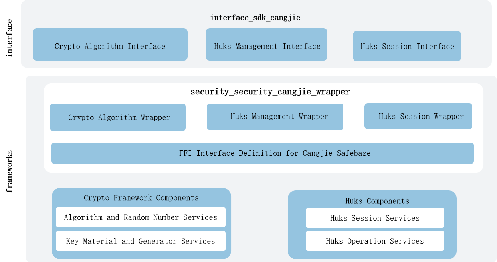

# security_security_cangjie_wrapper

## Introduction

The CangJie is a Cangjie API encapsulated on OpenHarmony based on the capabilities of the security subsystem. The security subsystem provides capabilities to protect the system security, data security, and application security of OpenHarmony.

The current supported functions of the security foundation capability Cangjie interface include basic encryption and decryption algorithms, huks management functions, and huks session functions.

The security cangjie interface currently under development only supports standard devices.

## Architecture
**Figure 1** security_cangjie_wrapper architecture



As shown in the architecture diagram:

- Basic Crypto Algorithm Functionality: The primary purpose of the basic crypto algorithm functionality is to abstract the underlying hardware and algorithm libraries, providing a unified crypto algorithm interface for upper-layer applications. Its key features include crypto operations, key material and generator management, encryption/decryption, signature/verification, secure random number generation, and related functionalities. By leveraging this capability, developers can ignore the differences among various third-party algorithm libraries, enabling rapid development.

- Huks Management Functionality: The huks management functionality is designed to offer a complete, unified, and secure key lifecycle management interface for upper-layer applications, shielding them from the implementation differences of underlying hardware security modules (HSMs) and key management services. Its core operations include key generation and derivation, key storage, key import, key destruction, and other critical processes. By utilizing this functionality, developers can bypass the complexities and security policy variations of different key storage mediums, ensuring the confidentiality, integrity, and availability of key materials. This facilitates secure, reliable, and efficient business development.

- Huks Session Functionality: The huks session functionality is one of the core security capabilities provided by the HUKS system. Built upon a unified key management foundation, its primary goal is to offer upper-layer applications a secure and efficient mechanism for key negotiation and encrypted data communication. HUKS leverages the key session functionality to perform data operations and provides the following APIs for developers:

  initSession: Initialize a huks session.

  updateSession: Update the session for processing large data in segments.

  finishSession: Finalize the current key operation.

  abortSession: Cancel the ongoing session.

## Directory Structure

```
base/security/security_cangjie_wrapper
├── figures                         # Architecture Pictures
├── kit                             # Cangjie Kit Code
|   ├── CryptoArchitectureKit       # Encryption and Decryption Algorithms Kit
|   ├── UniversalKeystoreKit        # Huks Management And Huks Session Kit
├── ohos                            # Cangjie Security Code
|    ├── crypto_framework           # Encryption And Decryption Algorithms Interface
|    └── huks                       # Huks Management And Huks Seesion Interface
└── test                            # Cangjie test code    
```

## Usage

The security_cangjie_wrapper provides the following capabilities:

-   Basic Encryption and Decryption Capabilities.
-   Huks Management.
-   Huks Session.

Compared to ArkTS, the following features are currently not supporte:

-   Program Access Control.
-   Certificate Module.
-   User Authentication.
-   Crypto Plugin Functionality.


For security APIs, please refer to[ohos.security.huks](https://gitcode.com/openharmony-sig/arkcompiler_cangjie_ark_interop/blob/master/doc/API_Reference/source_zh_cn/apis/UniversalKeystoreKit/cj-apis-security_huks.md).[ohos.security.crypto_framework](https://gitcode.com/openharmony-sig/arkcompiler_cangjie_ark_interop/blob/master/doc/API_Reference/source_zh_cn/apis/CryptoArchitectureKit/cj-apis-crypto.md).
For relevation guidance, please refer to [security Development Guide](https://gitcode.com/openharmony-sig/arkcompiler_cangjie_ark_interop/tree/master/doc/Dev_Guide/source_zh_cn/security).

## Code Contribution

Developers are welcome to contribute code, documentation, etc. For specific contribution processes and methods, please refer to [Code Contribution](https://gitcode.com/openharmony/docs/blob/master/en/contribute/code-contribution.md).

## Repositories Involved

[security_huks](https://gitee.com/openharmony/security_huks/blob/master/README.md)

[security_crypto_framework](https://gitee.com/openharmony/security_crypto_framework)
