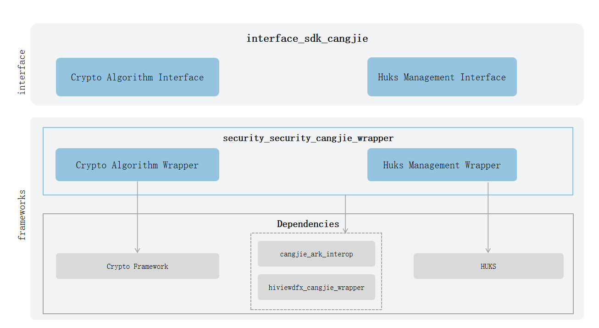

# security_security_cangjie_wrapper(beta feature)

## Introduction

The security subsystem provides capabilities to protect the system security, data security, and application security of OpenHarmony.

The current supported functions of the security foundation capability Cangjie interface include basic encryption and decryption algorithms, huks management functions, and huks session functions.

The security cangjie interface currently under development only supports standard devices.

## Architecture
**Figure 1** security_cangjie_wrapper architecture



As shown in the architecture diagram:

interface:

- Crypto Algorithm Interface: The primary purpose of the basic crypto algorithm functionality is to abstract the underlying hardware and algorithm libraries, providing a unified crypto algorithm interface for upper-layer applications. Its key features include crypto operations, key material and generator management, encryption/decryption, signature/verification, secure random number generation, and related functionalities. By leveraging this capability, developers can ignore the differences among various third-party algorithm libraries, enabling rapid development.
- Huks Management Interface: The huks management functionality is designed to offer a complete, unified, and secure key lifecycle management interface for upper-layer applications, shielding them from the implementation differences of underlying hardware security modules (HSMs) and key management services. Its core operations include key generation and derivation, key storage, key import, key destruction, and other critical processes. By utilizing this functionality, developers can bypass the complexities and security policy variations of different key storage mediums, ensuring the confidentiality, integrity, and availability of key materials. This facilitates secure, reliable, and efficient business development.
- Huks Session Interface: The huks session functionality is one of the core security capabilities provided by the HUKS system. Built upon a unified key management foundation, its primary goal is to offer upper-layer applications a secure and efficient mechanism for key negotiation and encrypted data communication. HUKS leverages the key session functionality to perform data operations and providesAPIs for developers.

framework:

- Crypto Algorithm Wrapper: Provides Implementation encapsulation of Cangjie Crypto Algorithm, providing Crypto Algorithm capabilities.
- Huks Management Wrapper: Provides Implementation encapsulation of Cangjie Huks Management, providing Huks Management capabilities.
- Huks Session Wrapper: Provides Implementation encapsulation of Cangjie Huks Session, providing Huks Session capabilities.
- FFI Interface Definition for Cangjie Safebase: Responsible for defining the C Language interoperability Cangjie interface, which is used to realize the Cangjie Safebase capabilities.

- Explanation of Dependencies in the Architecture Diagram:

- Crypto Framework: Responsible for providing functions related to encryption and decryption, signature and verification, message authentication codes, hashing, secure random numbers, etc.
- HUKS: Responsible for providing keystore capabilities, including functions such as key management and cryptographic operations on keys.
- cangjie_ark_interop: Responsible for providing Cangjie APILevel class definitions, which are used to annotate APIs, as well as providing the definition of BusinessException class that is thrown to users.
- hiviewdfx_cangjie_wrapper: Responsible for providing logging interfaces, which are used to print logs at key points in the execution path.

## Directory Structure

```
base/security/security_cangjie_wrapper
├── figures                         # Architecture Pictures
├── kit                             # Cangjie Kit Code
|   ├── CryptoArchitectureKit       # Encryption and Decryption Algorithms Kit
|   ├── UniversalKeystoreKit        # Huks Management And Huks Session Kit
├── ohos                            # Cangjie Security Code
|   ├── crypto_framework           # Encryption And Decryption Algorithms Interface
|   └── huks                       # Huks Management And Huks Seesion Interface
|       ├── huks_key_item.cj        # Huks Management Interface
|       └── huks_session.cj         # Huks Seesion Interface
└── test                            # Cangjie test code
    ├── crypto                      # crypto test code
    └── security_huks               # security_huks test code
```

## Usage

The current security basic capability Cangjie wrapper provides the following functions:

- Cryptographic algorithm library framework interface: Only provides cryptographic operations for keys, without key management functions. Therefore, when using the algorithm library, the application needs to manage the keys itself, which is suitable for scenarios where temporary session keys are only used in memory, or scenarios where the application implements secure key storage itself. It mainly includes the following functions:

  - Key generation: Generate algorithm library key objects according to the specified algorithm and support specifying binary data as key objects to generate key objects. Currently supports AES, 3DES, SM4, and HMAC algorithms. For specific specifications, refer to [Symmetric Key Generation and Conversion Specifications](https://gitcode.com/openharmony-sig/arkcompiler_cangjie_ark_interop/blob/master/doc/Dev_Guide/source_zh_cn/security/CryptoArchitectureKit/cj-crypto-sym-key-generation-conversion-spec.md). For related guidance, refer to [Randomly Generate Symmetric Keys](https://gitcode.com/openharmony-sig/arkcompiler_cangjie_ark_interop/blob/master/doc/Dev_Guide/source_zh_cn/security/CryptoArchitectureKit/cj-crypto-generate-sym-key-randomly.md) and [Generate Key Objects by Specifying Binary Data](https://gitcode.com/openharmony-sig/arkcompiler_cangjie_ark_interop/blob/master/doc/Dev_Guide/source_zh_cn/security/CryptoArchitectureKit/cj-crypto-convert-binary-data-to-sym-key.md).

  - Encryption and decryption: Provides encryption and decryption interfaces for the algorithm library. For specific specifications, refer to [Symmetric Key Encryption and Decryption Algorithm Specifications](https://gitcode.com/openharmony-sig/arkcompiler_cangjie_ark_interop/blob/master/doc/Dev_Guide/source_zh_cn/security/CryptoArchitectureKit/cj-crypto-sym-encrypt-decrypt-spec.md). For related guidance, refer to [Using AES Symmetric Key Encryption and Decryption](https://gitcode.com/openharmony-sig/arkcompiler_cangjie_ark_interop/blob/master/doc/Dev_Guide/source_zh_cn/security/CryptoArchitectureKit/cj-crypto-aes-sym-encrypt-decrypt-gcm.md).

  - Message digest calculation: Message digest algorithm is an algorithm that can generate a fixed-length digest from an input message of any length through specific operations. Message digest algorithms are also called hash algorithms or one-way hash algorithms. For specific algorithm specifications, refer to [Message Digest Calculation Specifications](https://gitcode.com/openharmony-sig/arkcompiler_cangjie_ark_interop/blob/master/doc/Dev_Guide/source_zh_cn/security/CryptoArchitectureKit/cj-crypto-generate-message-digest-overview.md). For related guidance, refer to [Using SHA256 Message Digest Calculation](https://gitcode.com/openharmony-sig/arkcompiler_cangjie_ark_interop/blob/master/doc/Dev_Guide/source_zh_cn/security/CryptoArchitectureKit/cj-crypto-generate-message-digest.md).

  - Secure random number generation: Secure random number generation algorithm to generate secure random numbers. For related guidance, refer to [Secure Random Number Generation](https://gitcode.com/openharmony-sig/arkcompiler_cangjie_ark_interop/blob/master/doc/Dev_Guide/source_zh_cn/security/CryptoArchitectureKit/cj-crypto-generate-random-number.md).

- Key management function interface: Provides unified secure operation capabilities for various keys to businesses/applications, mainly including the following functions:
  - Key generation and import: Provides key generation and import functions. For specific specifications, refer to [Key Generation and Import Specifications](https://gitcode.com/openharmony-sig/arkcompiler_cangjie_ark_interop/blob/master/doc/Dev_Guide/source_zh_cn/security/UniversalKeystoreKit/cj-huks-key-generation-overview.md). For specific key generation, refer to [Key Generation](https://gitcode.com/openharmony-sig/arkcompiler_cangjie_ark_interop/blob/master/doc/Dev_Guide/source_zh_cn/security/UniversalKeystoreKit/cj-huks-key-generation.md).
  - Key usage: To achieve protection of data confidentiality, integrity, etc., the generated/imported keys can be used to perform key operations on data, such as: encryption and decryption, signature verification, key agreement, key derivation. For related guidance, refer to [Key Usage Introduction and General Process](https://gitcode.com/openharmony-sig/arkcompiler_cangjie_ark_interop/blob/master/doc/Dev_Guide/source_zh_cn/security/UniversalKeystoreKit/cj-huks-key-use-overview.md).
  - Key deletion: To ensure data security, the key should be deleted when it is no longer needed. For related guidance, refer to [Key Deletion](https://gitcode.com/openharmony-sig/arkcompiler_cangjie_ark_interop/blob/master/doc/Dev_Guide/source_zh_cn/security/UniversalKeystoreKit/cj-huks-delete-key.md).
  - Key attestation: HUKS provides legitimacy proof capability for keys, mainly applied to the proof of public keys of asymmetric keys. For related guidance, refer to [Non-anonymous Key Attestation](https://gitcode.com/openharmony-sig/arkcompiler_cangjie_ark_interop/blob/master/doc/Dev_Guide/source_zh_cn/security/UniversalKeystoreKit/cj-huks-key-attestation-arkts.md).

For related APIs of security basic capabilities, please refer to [Cangjie Cryptographic Algorithm Library Framework](https://gitcode.com/openharmony-sig/arkcompiler_cangjie_ark_interop/blob/master/doc/API_Reference/source_zh_cn/apis/CryptoArchitectureKit/cj-apis-crypto.md) and [Cangjie Key Management Function](https://gitcode.com/openharmony-sig/arkcompiler_cangjie_ark_interop/blob/master/doc/API_Reference/source_zh_cn/apis/UniversalKeystoreKit/cj-apis-security_huks.md).

## Constraints

Compared to ArkTS, the following features are currently not supporte:

- Program Access Control.
- Certificate Module.
- User Authentication.
- Crypto Plugin Functionality.

## Code Contribution

Developers are welcome to contribute code, documentation, etc. For specific contribution processes and methods, please refer to [Code Contribution](https://gitcode.com/openharmony/docs/blob/master/en/contribute/code-contribution.md).

## Repositories Involved

[arkcompiler_cangjie_ark_interop](https://gitcode.com/openharmony-sig/arkcompiler_cangjie_ark_interop)

[hiviewdfx_hiviewdfx_cangjie_wrapper](https://gitcode.com/openharmony-sig/hiviewdfx_hiviewdfx_cangjie_wrapper)

[security_crypto_framework](https://gitcode.com/openharmony/security_crypto_framework)

[security_huks](https://gitcode.com/openharmony/security_huks)
