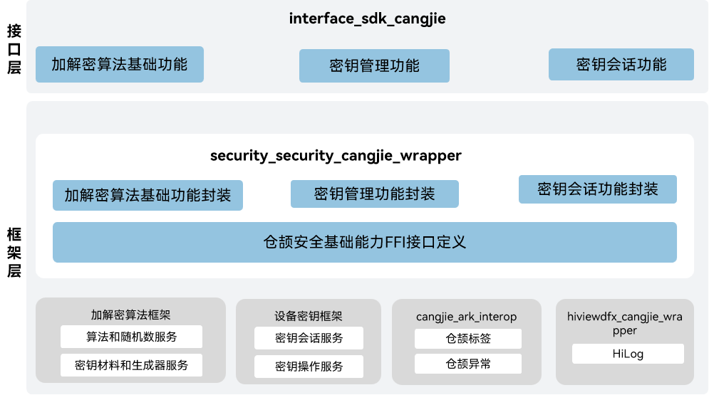

# 安全基础能力仓颉接口

## 简介

安全基础能力仓颉接口包括系统安全、数据安全、应用安全等功能，为OpenHarmony提供有效保护应用和用户数据的能力。

安全基础能力仓颉接口当前支持的功能，包括加解密算法基础功能、密钥管理功能、密钥会话功能。

当前开放的安全基础能力仓颉接口仅支
持standard设备。

## 系统架构

**图 1**  安全基础能力仓颉架构图



安全基础能力仓颉接口当前由两个部件组成:
加解密算法框架提供加解密、签名验签、消息验证码、哈希、安全随机数等相关功能。
设备密钥管理框架为应用提供密钥库能力，包括密钥管理及密钥的密码学操作等功能。


## 目录

```
├── figures                         # 存放README中的架构图
├── kit                             # 仓颉安全kit化代码
|   ├── CryptoArchitectureKit       # 加解密算法库Kit
|   ├── UniversalKeystoreKit        # 设备密钥管理Kit
├── ohos                            # 仓颉安全基础能力接口实现
    ├── crypto_framework            # 密码算法库加解密相关接口
    ├── huks                        # 密钥管理相关接口
```

## 使用说明

当前安全基础能力仓颉接口提供了以下功能：
-  加解密算法基础功能
-  密钥管理功能
-  密钥会话功能

与ArkTS相比，暂不支持以下功能：
-   程序访问控制功能
-   证书模块
-   用户认证

安全基础能力相关API请参见[ohos.security.huks](https://gitcode.com/openharmony-sig/arkcompiler_cangjie_ark_interop/blob/master/doc/API_Reference/source_zh_cn/apis/UniversalKeystoreKit/cj-apis-security_huks.md)，[ohos.security.crypto_framework](https://gitcode.com/openharmony-sig/arkcompiler_cangjie_ark_interop/blob/master/doc/API_Reference/source_zh_cn/apis/CryptoArchitectureKit/cj-apis-crypto.md)，相关指导请参见[安全基础能力开发指南](https://gitcode.com/openharmony-sig/arkcompiler_cangjie_ark_interop/tree/master/doc/Dev_Guide/source_zh_cn/security)。

## 参与贡献

欢迎广大开发者贡献代码、文档等，具体的贡献流程和方式请参见[参与贡献](https://gitcode.com/openharmony/docs/blob/master/zh-cn/contribute/%E5%8F%82%E4%B8%8E%E8%B4%A1%E7%8C%AE.md)。


## 相关仓

[security_huks](https://gitee.com/openharmony/security_huks/blob/master/README_zh.md)

[security_crypto_framework](https://gitee.com/openharmony/security_crypto_framework/blob/master/README_zh.md)
