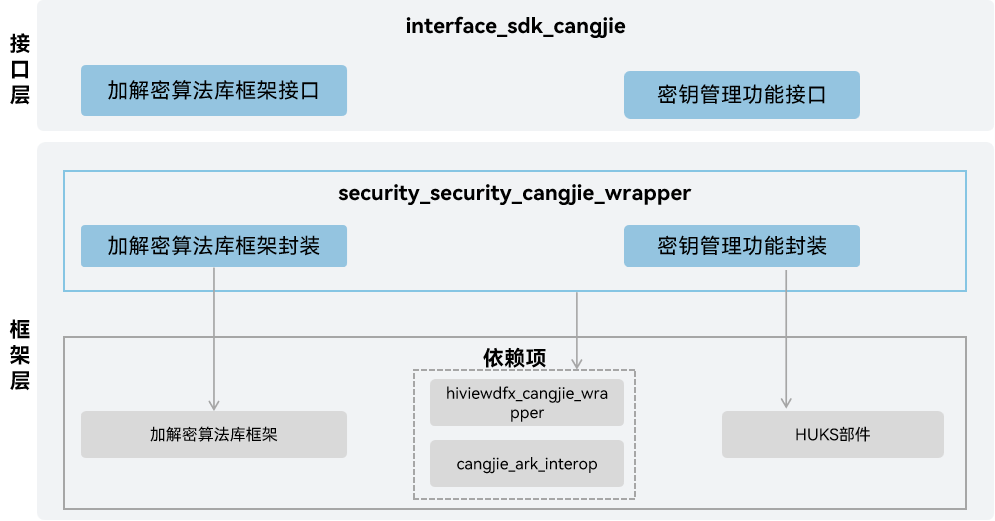

# 安全基础能力仓颉封装

## 简介

安全基础能力仓颉封装为实现系统安全、数据安全、应用安全领域提供支撑，通过提供加解密算法框架、密钥管理、数据保护、设备证书、设备安全等级管理、鉴权认证等能力，有效保护OpenHarmony应用和用户数据的能力。当前支持的功能包括加解密算法库框架功能和密钥管理功能，相关功能仅支持standard设备。

## 系统架构

**图 1** 安全基础能力仓颉架构图



接口层：

- 加解密算法库框架接口：加解密算法库框架接口主要是为了屏蔽底层硬件和算法库，向上提供统一的密码算法库加解密相关接口。它的主要功能提供密钥生成和转换、加解密、消息摘要、安全随机数相关功能。开发者可以通过使用该功能，忽略底层不同三方算法库的差异，实现迅捷开发。
- 密钥管理功能：密钥管理功能主要是为了向上层应用提供一套完整、统一、安全的密钥生命周期管理接口。
  - 完整性：包括密钥生成与派生、密钥存储、密钥导入、销毁等一系列关键操作，支持密钥管理的主要功能。
  - 统一性：密码学操作均使用统一的接口进行管理，屏蔽不同硬件安全模块和底层密钥管理服务的实现差异。
  - 安全性：底层使用TEE（Trusted Execution Environment）提供的可信环境，用户态无法获得密钥数据，即便内核受到威胁，也能确保密钥不被泄露。

  开发者通过调用该功能，可以忽略底层不同密钥存储介质的复杂细节和安全策略差异，确保密钥材料的机密性、完整性和可用性，从而实现安全、可靠、高效的业务开发。

框架层：

- 加解密算法库框架封装：仓颉加解密算法基础功能的实现封装，提供加解密算法基础功能。
- 密钥管理功能封装：仓颉密钥管理功能的实现封装，提供密钥管理功能。

架构图中的依赖部件引入说明：

- 加解密算法库框架：负责提供加解密、签名验签、消息验证码、哈希、安全随机数等相关功能。
- HUKS部件：负责提供密钥库能力，包括密钥管理及密钥的密码学操作等功能。
- cangjie_ark_interop：负责提供仓颉注解类定义，用于对API进行标注，以及提供抛向用户的BusinessException异常类定义。
- hiviewdfx_cangjie_wrapper：负责提供日志接口，用于在关键路径处打印日志。

## 目录

```
base/security/security_cangjie_wrapper
├── figures                         # 存放README中的架构图
├── kit                             # 仓颉安全kit化代码
|   ├── CryptoArchitectureKit       # 加解密算法库Kit
|   ├── UniversalKeystoreKit        # 设备密钥管理Kit
├── ohos                            # 仓颉安全基础能力接口实现
|   ├── crypto_framework            # 密码算法库加解密相关接口
|   └── huks                        # 密钥相关接口
└── test                            # 仓颉测试代码
    ├── crypto                      # crypto测试用例
    └── security_huks               # security_huks测试用例
```

## 使用说明

当前安全基础能力仓颉封装提供了以下功能：

- 加解密算法库框架接口：仅提供密钥的密码学操作，不提供密钥管理功能。因此，使用算法库时，需要应用自己来保管密钥，适用于临时会话密钥等仅在内存中使用的场景，或者应用自己实现密钥安全存储的场景，主要包含以下功能：

  - 密钥生成：根据指定算法生成算法库密钥对象并支持指定二进制数据作为密钥生成密钥对象，当前支持AES、3DES、SM4、HMAC算法，具体规格参考[对称密钥生成规格](https://gitcode.com/openharmony-sig/arkcompiler_cangjie_ark_interop/blob/master/doc/Dev_Guide/source_zh_cn/security/CryptoArchitectureKit/cj-crypto-sym-key-generation-conversion-spec.md)。相关指导参考[随机生成对称密钥对象](https://gitcode.com/openharmony-sig/arkcompiler_cangjie_ark_interop/blob/master/doc/Dev_Guide/source_zh_cn/security/CryptoArchitectureKit/cj-crypto-generate-sym-key-randomly.md)，[指定二进制数据生成密钥对象](https://gitcode.com/openharmony-sig/arkcompiler_cangjie_ark_interop/blob/master/doc/Dev_Guide/source_zh_cn/security/CryptoArchitectureKit/cj-crypto-convert-binary-data-to-sym-key.md)。

  - 加解密：提供加解密算法库加解密接口，具体规格参考[对称密钥加解密算法规格](https://gitcode.com/openharmony-sig/arkcompiler_cangjie_ark_interop/blob/master/doc/Dev_Guide/source_zh_cn/security/CryptoArchitectureKit/cj-crypto-sym-encrypt-decrypt-spec.md)。相关指导参考[使用AES对称密钥加解密](https://gitcode.com/openharmony-sig/arkcompiler_cangjie_ark_interop/blob/master/doc/Dev_Guide/source_zh_cn/security/CryptoArchitectureKit/cj-crypto-aes-sym-encrypt-decrypt-gcm.md)。

  - 消息摘要计算：消息摘要算法是一种能将任意长度的输入消息，通过特定运算生成固定长度摘要的算法。消息摘要算法也被称为哈希算法或单向散列算法，具体算法规格参考[消息摘要计算规格](https://gitcode.com/openharmony-sig/arkcompiler_cangjie_ark_interop/blob/master/doc/Dev_Guide/source_zh_cn/security/CryptoArchitectureKit/cj-crypto-generate-message-digest-overview.md)。相关指导参考[使用SHA256消息摘要计算](https://gitcode.com/openharmony-sig/arkcompiler_cangjie_ark_interop/blob/master/doc/Dev_Guide/source_zh_cn/security/CryptoArchitectureKit/cj-crypto-generate-message-digest.md)。

  - 安全随机数生成:安全随机数生成算法，生成安全随机数。相关指导参考[安全随机数生成](https://gitcode.com/openharmony-sig/arkcompiler_cangjie_ark_interop/blob/master/doc/Dev_Guide/source_zh_cn/security/CryptoArchitectureKit/cj-crypto-generate-random-number.md)。


- 密钥管理功能接口：向业务/应用提供各类密钥的统一安全操作能力，主要包含以下功能：
  - 密钥生成和导入：提供密钥生成和导入功能，具体规格参考[密钥生成和导入规格](https://gitcode.com/openharmony-sig/arkcompiler_cangjie_ark_interop/blob/master/doc/Dev_Guide/source_zh_cn/security/UniversalKeystoreKit/cj-huks-key-generation-overview.md)，具体生成密钥参考[生成密钥](https://gitcode.com/openharmony-sig/arkcompiler_cangjie_ark_interop/blob/master/doc/Dev_Guide/source_zh_cn/security/UniversalKeystoreKit/cj-huks-key-generation.md)。
  - 密钥使用：为了实现对数据机密性、完整性等保护，可使用生成/导入的密钥，对数据进行密钥操作，比如：加密解密、签名验签、密钥协商、密钥派生。相关指导参考[密钥使用介绍及通用流程](https://gitcode.com/openharmony-sig/arkcompiler_cangjie_ark_interop/blob/master/doc/Dev_Guide/source_zh_cn/security/UniversalKeystoreKit/cj-huks-key-use-overview.md)。
  - 密钥删除：为保证数据安全性，当不需要使用该密钥时，应该删除密钥。相关指导参考[密钥删除](https://gitcode.com/openharmony-sig/arkcompiler_cangjie_ark_interop/blob/master/doc/Dev_Guide/source_zh_cn/security/UniversalKeystoreKit/cj-huks-delete-key.md)。
  - 密钥证明：HUKS为密钥提供合法性证明能力，主要应用于非对称密钥的公钥的证明，相关指导参考[非匿名密钥证明](https://gitcode.com/openharmony-sig/arkcompiler_cangjie_ark_interop/blob/master/doc/Dev_Guide/source_zh_cn/security/UniversalKeystoreKit/cj-huks-key-attestation-arkts.md)。

安全基础能力相关API请参见[仓颉加解密算法库框架](https://gitcode.com/openharmony-sig/arkcompiler_cangjie_ark_interop/blob/master/doc/API_Reference/source_zh_cn/apis/CryptoArchitectureKit/cj-apis-crypto.md)，[仓颉密钥管理功能](https://gitcode.com/openharmony-sig/arkcompiler_cangjie_ark_interop/blob/master/doc/API_Reference/source_zh_cn/apis/UniversalKeystoreKit/cj-apis-security_huks.md)。
## 约束

与ArkTS提供的API能力相比：

- 加解密算法库框架暂不支持以下功能：
  - 非对称加密算法相关功能。
  - 签名验签。
  - 密钥协商。
  - 密钥派生。

- 密钥管理功能暂不支持以下功能：
  - 加密导入/导出密钥。
  - 查询密钥别名集。

- 暂不支持关键资产存储服务、数据保护服务、设备安全服务、企业数据保护服务、在线认证服务、设备证书服务、用户认证服务功能。

## 参与贡献

欢迎广大开发者贡献代码、文档等，具体的贡献流程和方式请参见[参与贡献](https://gitcode.com/openharmony/docs/blob/master/zh-cn/contribute/%E5%8F%82%E4%B8%8E%E8%B4%A1%E7%8C%AE.md)。

## 相关仓

[arkcompiler_cangjie_ark_interop](https://gitcode.com/openharmony-sig/arkcompiler_cangjie_ark_interop)

[hiviewdfx_hiviewdfx_cangjie_wrapper](https://gitcode.com/openharmony-sig/hiviewdfx_hiviewdfx_cangjie_wrapper)

[security_crypto_framework](https://gitcode.com/openharmony/security_crypto_framework)

[security_huks](https://gitcode.com/openharmony/security_huks)
